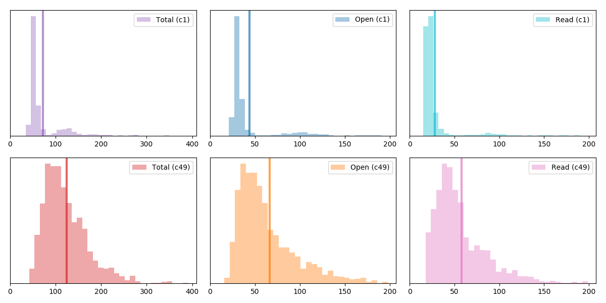
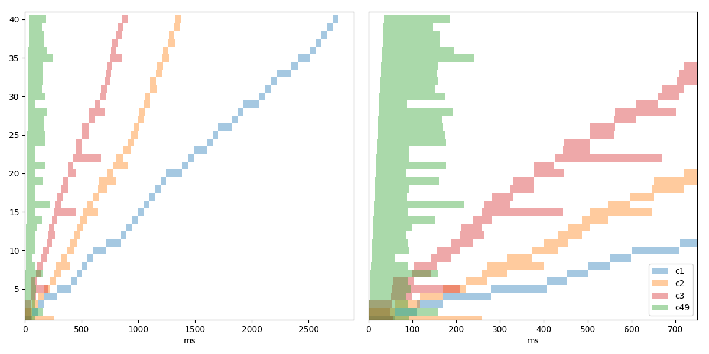
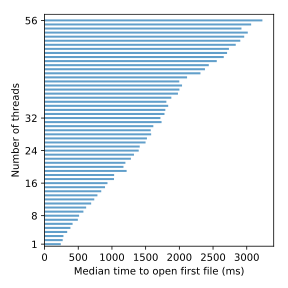

# Understanding GDAL performance in the cloud


- Intro and Motivation
  - why cloud
  - S3/HTTP/GDAL

- Rasterio Settings

- Benchmark
  - Workload description
  - Choice of metric: peak throughput in file per second
  - Results graphs + analysis
  - Warmup costs discussion

- Conclusion


## Introduction

There is a common trend across many industries and government agencies to move significant
portions of their IT infrastructure and data to the "cloud". Rather than maintaining complex
server farms in-house, expertise of public cloud providers like Amazon Web Services,
Google Cloud, Microsoft Azure, and many others is leveraged to deliver more robust, secure
and hopefully cost effective solutions.

AWS and S3 data storage solutions are particularly popular. Entities operating in GIS
(Geographic Information Systems) domain, with their massive data sets, are particularly
well positioned to benefit from the commoditization of public cloud infrastructure.
Already [Landsat 8](https://registry.opendata.aws/landsat-8/)
and [Sentinel](https://registry.opendata.aws/sentinel-2/) data is available for public
access from S3, as well as [some others](https://registry.opendata.aws/?search=gis), and
these archives are growing every day.


### Amazon S3 and Data Access

Amazon S3 is the most cost effective way to store "active" data in AWS, for archival needs
there is [Glacier](https://aws.amazon.com/glacier/). S3 is an "object store", but it can
be superficially viewed as a file system, to which access is performed via authenticated
HTTP. The details of authentication are quite complex, but also not very important, as
libraries deal with that aspect of things. Authentication is used for access control, or
in case of public data sets with "user pays" policy for billing the user for access.
Landsat 8 data can be accessed without any credentials, and Sentinel is switching to user
pays model.

[GDAL](http://gdal.org) Geospatial Data Abstraction Library has supported working with
HTTP resources for a while now, and S3 authentication support has been added more
recently. There is constant progress in improving performance and usability when working
with network assets. Just because some file is on a remote server, it doesn't mean that
the entire file needs to be downloaded before accessing pixel data. HTTP supports
requesting partial content of a file, S3 understand that as well.

A common data storage format in GIS is GeoTIFF. GeoTIFF files can be internally tiled, so
you can access a portion of a raster without ever reading the rest of the file. GDAL can
do exactly that, it will first fetch enough data to parse the header data, then will fetch
"just enough" compressed pixel data to return raster data for a region of interest. TIFF
being an extremely flexible format can be hard to work with over HTTP,
so [Cloud Optimized GeoTIFF](https://trac.osgeo.org/gdal/wiki/CloudOptimizedGeoTIFF)
profile has been developed to constraint how TIFF files are constructed to enable best
possible efficiency of access over HTTP.


### Rasterio

[Rasterio](https://github.com/mapbox/rasterio) is a very convenient Python interface to a
large subset of GDAL functionality. Rasterio is especially useful when working with cloud
resources as it integrates well with Amazons `boto3` library for managing S3 access
credentials.

Reading an image from s3 bucket can be as simple as:

```python
with rasterio.open('s3://bucket/file.tif', 'r') as f:
   im = f.read()
```

If you configured your AWS credentials either with `aws` command line or by using AIM (AWS
Identity Management) roles in the cloud, code above will just work. To get best
performance out of it we will need to do more work though. There is a number of things we
need to configure inside GDAL, the most important one is to tell GDAL not to look for
side-car files, as this takes a lot of HTTP requests and takes a long time, and Cloud
Optimized GeoTIFFs should not need side-car files. This is achieved with
`GDAL_DISABLE_READDIR_ON_OPEN=YES` option, we will also set
`CPL_VSIL_CURL_ALLOWED_EXTENSIONS=tif` and `VSI_CACHE=YES`.

With `rasterio` we use `raterio.Env` construct to change default GDAL settings:

```python
with rasterio.Env(GDAL_DISABLE_READDIR_ON_OPEN=True,
                  CPL_VSIL_CURL_ALLOWED_EXTENSIONS='tif',
                  VSI_CACHE=True,
                  region_name='us-west-2'):
  with rasterio.open('s3://bucket/file.tif', 'r') as f:
    im = f.read()
```

Notice the extra parameter `region_name=...`, this should be set to the region your bucket
is located in, your compute should be running in the same region too for best performance.
If you omit it, and default region name is not configured or configured to the wrong value
for a given bucket, you might end up with performance penalty due to HTTP redirects,
things will probably still work so you might not notice immediately.

For the best performance, environment setup should happen once per worker thread, each
worker thread will need their own. Re-using environment across many file reads is
particularly important if you are using AIM for your credentials in the cloud (and you
should for security reasons), as obtaining credentials in that case can take some time,
and there is no guarantee that they will be cached somewhere after environment is teared
down.


## Benchmark

So what performance should we expect when working with COGs from S3? Can we use more
threads to speed things up? How many threads? We ran some benchmarks to find out.

Benchmark [code](https://github.com/Kirill888/benchmark-rio-s3) is available online for
you to use and extend for your needs. Results for Landsat 8 data is presented in this
report.


### Workload Description

Current version of benchmark concentrates on a particularly pathological use case for S3
access: reading small region of pixels from a large number of files, a kind of pixel
gather operation. Given a large number (1K+) of similarly structured COGs (same pixel
type, same compression settings, same tiling regime), read one internal tile from each
file and return a 3-d array of these tiles stacked on top of each other. This type of
workload is useful for running change analysis for example. It is particularly challenging
from the performance perspective as compared to local file system random access latency
when reading from S3 is significantly higher.

Test dataset used to collect statistics:

- 1,278 Landsat 8 files
   - `uint16` pixels
   - DEFLATE compression with line differencing predictor
   - 512x512 pixel tiles
- Reading single center tile from each file

```
s3://landsat-pds/c1/L8/106/069/LC08_L1GT_106069_20171226_20171226_01_RT/LC08_L1GT_106069_20171226_20171226_01_RT_B1.TIF
s3://landsat-pds/c1/L8/106/069/LC08_L1GT_106069_20171226_20171226_01_RT/LC08_L1GT_106069_20171226_20171226_01_RT_B2.TIF
s3://landsat-pds/c1/L8/106/069/LC08_L1GT_106069_20171226_20171226_01_RT/LC08_L1GT_106069_20171226_20171226_01_RT_B3.TIF
...
s3://landsat-pds/c1/L8/106/071/LC08_L1TP_106071_20180519_20180519_01_RT/LC08_L1TP_106071_20180519_20180519_01_RT_B7.TIF
s3://landsat-pds/c1/L8/106/071/LC08_L1TP_106071_20180519_20180519_01_RT/LC08_L1TP_106071_20180519_20180519_01_RT_B8.TIF
s3://landsat-pds/c1/L8/106/071/LC08_L1TP_106071_20180519_20180519_01_RT/LC08_L1TP_106071_20180519_20180519_01_RT_B9.TIF
```

Test ran in the same region as the data `us-west-2` (Oregon) using `m5.xlarge` instance
type. Test covers running with 1 to 56 concurrent threads, test repeated 3 times for every
configuration and the best result chosen for each, for comparison across configurations.


### Results and Analysis

First let's look at stats gathered when running with a single processing thread

```
-------------------------------------------------------------
Tile: 8_7#1
   - blocks  : 512x512@uint16
   - nthreads: 1
-------------------------------------------------------------

Files read             : 1278
Total data bytes       : 493,405,576
  (excluding headers)
Bytes per chunk        : 386076 [241315..467655]

Time:
 per tile:
  - total    72.329 [34.5.....1012.2] ms
  - open     44.075 [15.4......986.2] ms 59.8%
  - read     28.254 [14.8......805.9] ms 40.2%

 3841b1595346c5529181962af8077098..4a0422bb
 total_cpu: 92.00 sec
 walltime : 92.65 sec
-------------------------------------------------------------
```

Test completed in ~93 seconds, minimal latency to access one tile from a file was 34.5ms,
maximum latency was just over 1 second. Average latency per file was 72.3ms. When reading
just one tile from a file, cost of file open dominates, 60% of the time is spent waiting
for open to complete, and 40% to read the data.


Graphs above show distribution of open/read/total latency, and distribution of chunk sizes
(compressed size of tiles read). There is very little correlation between chunk size and
time to read, for these sizes (250-450 Kb) and when reading from within the same data
center, time to read is dominated by Time To First Byte delay, once data is ready it is
delivered quickly.

The fastest run we observed used 49 threads and completed in 3.39 seconds, a
significant improvement over single threaded performance.

```
---------------------------------------------------------------------------------------------------
Tile: 8_7#1                                      | Tile: 8_7#1
   - blocks  : 512x512@uint16                    |    - blocks  : 512x512@uint16
   - nthreads: 1                                 |    - nthreads: 49
   - One Thread                                  |    - Lowest overall latency
---------------------------------------------------------------------------------------------------
                                                 | 
Files read             : 1278                    | Files read             : 1278
Total data bytes       : 493,405,576             | Total data bytes       : 493,405,576
  (excluding headers)                            |   (excluding headers)
Bytes per chunk        : 386076 [241315..467655] | Bytes per chunk        : 386076 [241315..467655]
                                                 | 
Time:                                            | Time:
 per tile:                                       |  per tile:
  - total    72.329 [34.5.....1012.2] ms         |   - total   124.496 [42.1......476.1] ms
  - open     44.075 [15.4......986.2] ms 59.8%   |   - open     66.466 [15.8......412.4] ms 52.8%
  - read     28.254 [14.8......805.9] ms 40.2%   |   - read     58.030 [17.6......395.0] ms 47.2%
                                                 | 
 3841b1595346c5529181962af8077098..4a0422bb      |  3841b1595346c5529181962af8077098..4a0422bb
 total_cpu: 92.00 sec                            |  total_cpu: 159.00 sec
 walltime : 92.65 sec                            |  walltime : 3.39 sec
---------------------------------------------------------------------------------------------------
```

It should be noted that we intentionally exclude "warmup" time from the results above.
Section later on explains it in more detail, so 3.39 seconds is not from cold start to
results saved to local disk.



From graph above we can see that individual latency per file access increases as we use
more concurrent threads. This is probably due to both local interference as well as the
remote side being more busy with more concurrent requests. This is expected, and since
degradation is relatively minor overall throughput increases significantly with more
threads.



TK: latency hiding graphs discussion

### Peak Throughput

Rather than using time to completion we prefer "peak throughput" for comparing different
runs. There is a significant variance in latency of individual reads due to external
forces we can not control, large latency for individual file at the start of the
experiment will be hidden (won't affect total time much), but large latency for a file
towards the end of the experiment will potentially increase experiment time by a second or
two. This is not a problem if total experiment time is much larger than maximum latency of
individual read, but say 1 minute of reads with 40 worker threads will translate to half
an hour long single threaded test which is not very practical.

We compute throughput using the following strategy:

Every time a new file is finished processing (in any of the worker threads) we record time
from the start of the experiment and the number of files processed including this file.
Throughput is then `n_files/elapsed_time`, we plot this as a function of files completed.
We then take the maximum value observed during the experiment as a main metric of
performance.


TK: summary graph for threads

### Warmup Costs

Having more threads clearly helps to increase throughput, so if you need to process large
set of files throw as many resources at the task that your memory constraints allow.
Launching all these threads takes some time, also GDAL needs to perform some kind of per
thread initialization. What we observe is that reading the very first file in a worker
thread consistently takes significantly longer than "normal" for the rest of files. That
in itself is not surprising: establishing HTTP connection, creating thread-local
structures and other kinds of housekeeping tasks are expected. What's interesting is that
time to process first file consistently increases the more concurrent threads are
launched, suggesting that either some internal GDAL synchronization is taking place or
just CPU/RAM congestion is particularly severe for that stage of processing.



Ideally your software would create worker threads once on startup and keep re-using them
going forward, amortizing the spin up costs. For batch jobs that might not be possible so
you would need to balance start up latency vs higher throughput to minimize total
processing time.


## Conclusion

TK: summary, reference DEA, ODC 
